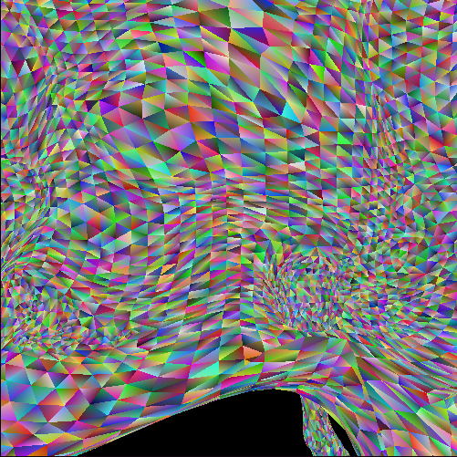

# MiniGL

A miniature version of the popular graphics library OpenGL. I implemented a simplified 3D rendering pipeline with flat shading using a z-buffer for hidden surfaces.

To run

scons

./minigl -i tests/xx.txt -s tests/xx.png -g

where xx is a value from 00-28
